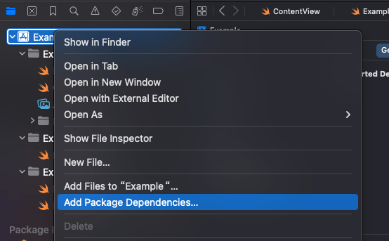
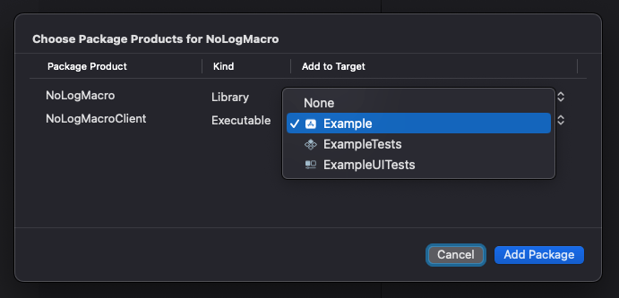
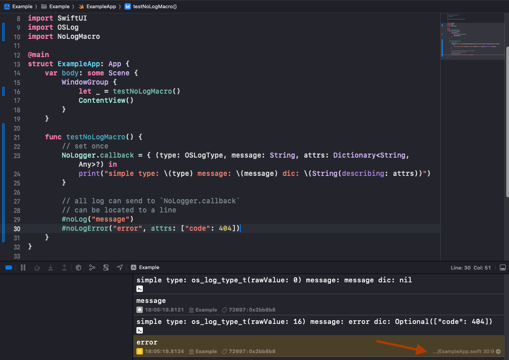

# **Not Only Log**

A swift macro that produces oslog with custom info.

> After upgrading Xcode 15, OSLog's `Logger` can provide good console log display. But our custom log doesn't support that, this library makes it work in a lightweight way.

## Using

### Add Package Dependency




### Using

Just like:

```
// set once
NoLogger.callback = { (type: OSLogType, message: String, attrs: Dictionary<String, Any>?) in
    print("simple type: \(type) message: \(message) dic: \(String(describing: attrs))")
}


// all log can send to `NoLogger.callback`
// **can be located to a line**

// same with `Logger().log(level: .default, "default")`
#noLog("message")
// and more custom info
#noLogError("error", attrs: ["code": 404])

// others
Logger().log(level: .info, "info")
#noLogInfo("info")
#noLogInfo("info", attrs: ["a": 2])

Logger().log(level: .debug, "debug")
#noLogDebug("debug")
#noLogDebug("debug", attrs: ["a": 3])

Logger().log(level: .error, "error")
#noLogError("error")
#noLogError("error", attrs: ["a": 4])

Logger().log(level: .fault, "fault")
#noLogFault("fault")
#noLogFault("fault", attrs: ["a": 5])
```



## TODO List

- support `Logger(subsystem: <#T##String#>, category: <#T##String#>)`
- using Swift Macro writing this lib